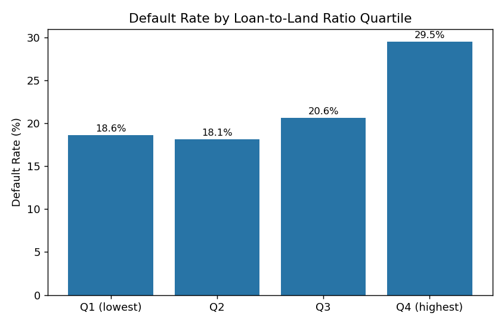
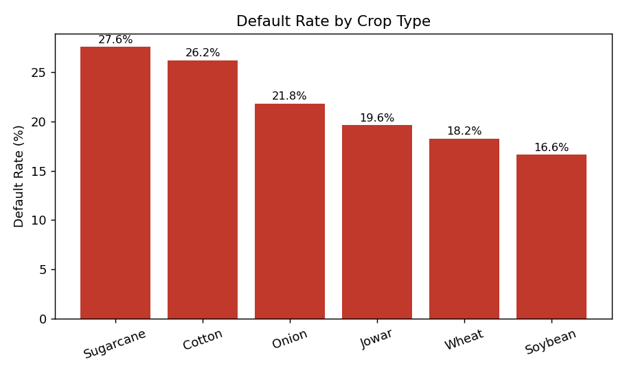
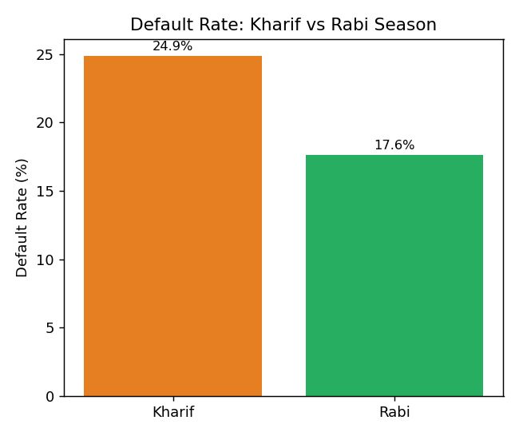
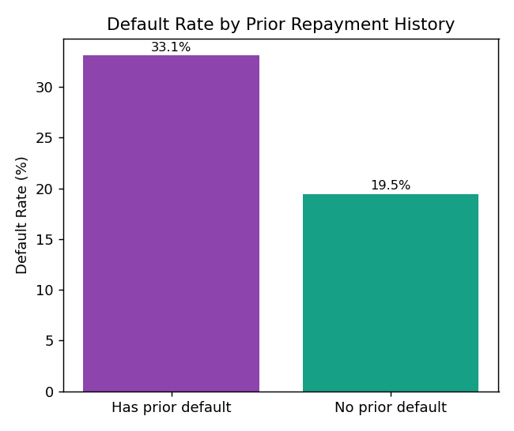

# Business Report: Farmer Loan Default Risk Analysis

**Prepared by:** Jaydeep Shinde
**Date:** July 2026
**Portfolio Project** — synthetic dataset modeled on cooperative-lending patterns

---

## Executive Summary

This report analyzes repayment behavior across 3,200 cooperative-society farmer
loans to identify which borrower and loan characteristics are associated with
higher default risk. The goal is to support early-warning segmentation so a
lending institution can flag high-risk applications before disbursement, rather
than reacting after a default occurs.

**Headline finding:** Loan-to-land ratio is the single strongest predictor of
default in this dataset — borrowers in the top risk quartile defaulted at
**29.5%**, roughly 60% higher than the lowest-risk quartile (18.1%).

---

## Business Context

Cooperative lending societies extend credit to farmers based on land holding,
crop type, and repayment history, often with thinner underwriting processes
than commercial banks. Understanding *which* loans are more likely to default
— before money goes out the door — directly protects the society's lending
capital and its ability to serve future borrowers.

---

## Methodology

- **Data:** 3,200 loan records (synthetic, modeled on realistic cooperative
  lending patterns — see Data Note below)
- **Tools:** SQL (JOINs, CTEs, Window Functions) for aggregation and ranking;
  Python (Pandas, Matplotlib) for exploratory analysis and visualization
- **Approach:** Segment default rate across five dimensions — crop type,
  season, loan-to-land ratio, prior repayment history, and region — to isolate
  which factors carry real predictive signal versus noise

---

## Key Findings

### 1. Loan-to-Land Ratio Is the Strongest Risk Signal

| Ratio Quartile | Default Rate |
|---|---|
| Q1 (lowest) | 18.6% |
| Q2 | 18.1% |
| Q3 | 20.6% |
| Q4 (highest) | **29.5%** |

Risk stays flat across the bottom three quartiles, then jumps sharply in the
top quartile. This suggests a **practical underwriting threshold** exists —
loans sized well beyond a farmer's land holding carry disproportionately
higher risk, rather than risk increasing gradually and linearly.

### 2. Crop Type Correlates With Repayment Risk

Cash/volatile-price crops default more often than staple crops:

| Crop | Default Rate |
|---|---|
| Sugarcane | 27.6% |
| Cotton | 26.2% |
| Onion | 21.8% |
| Jowar | 19.6% |
| Wheat | 18.2% |
| Soybean | 16.6% |

The gap between the highest (Sugarcane, 27.6%) and lowest (Soybean, 16.6%)
risk crops is **11 percentage points** — a meaningful difference for
crop-specific loan terms or reserve provisioning.

### 3. Seasonal (Monsoon) Dependency Increases Risk

- **Kharif** (monsoon-dependent) loans: **24.9%** default rate
- **Rabi** (irrigated/winter) loans: **17.6%** default rate

The ~7-point gap is consistent with Kharif crops' dependency on rainfall
timing and volume, which is outside the borrower's control — a structural
risk factor rather than a behavioral one.

### 4. Prior Default History Nearly Doubles Risk

- Borrowers with **any prior default**: **33.1%** default rate
- Borrowers with **no prior default**: **19.5%** default rate

Prior default history is the strongest individual-level (as opposed to
loan-level) signal in this analysis — nearly **1.7x** the risk of a
clean-history borrower.

### 5. Regional Variation Is Present but Modest

| Region | Default Rate | Risk Rank |
|---|---|---|
| Baramati | 24.1% | 1 (highest risk) |
| Daund | 23.2% | 2 |
| Phaltan | 22.0% | 3 |
| Malshiras | 20.1% | 4 |
| Indapur | 18.9% | 5 (lowest risk) |

The spread across regions (18.9%–24.1%) is real but narrower than the
loan-to-land ratio or prior-history effects — regional factors appear to be a
secondary signal rather than a primary driver.

---

## Recommendations

1. **Set a loan-to-land ratio cap or flag** for manual review — this is the
   single clearest lever available, given the sharp jump in the top quartile.
2. **Apply differentiated terms for high-volatility cash crops** (Sugarcane,
   Cotton) — e.g., shorter repayment cycles or higher collateral requirements
   — rather than uniform terms across all crop types.
3. **Treat prior default history as a hard underwriting signal**, not just a
   soft factor — the near-2x risk multiplier justifies stricter terms or
   smaller loan ceilings for repeat-risk borrowers.
4. **Build a seasonal buffer into Kharif loan terms** (e.g., a grace period
   tied to monsoon onset data) to account for the structural, weather-driven
   risk gap versus Rabi loans.

---

## Limitations

- This analysis uses a **synthetic dataset** built to reflect realistic
  cooperative-lending dynamics; findings illustrate the analytical approach
  and are directionally realistic, but are not derived from a real
  institution's live loan book.
- The dataset does not include macroeconomic variables (crop price indices,
  actual rainfall data) that would likely improve predictive accuracy in a
  production setting.
- Findings represent correlation, not causation — a full risk model would
  need to control for confounding between these variables (e.g., regions and
  crop types are not independent of each other).

---

## Data Note

Real cooperative-society loan records are confidential and were not used in
this analysis. The dataset was synthetically generated to reflect realistic
patterns in loan sizing, crop/season mix, and repayment behavior, informed by
direct exposure to loan processing during a Data Entry internship at a
farmer cooperative society. All code, queries, and analysis are original work
— see `generate_data.py`, `sql_analysis.py`, and `eda_visualize.py` in this
repository.
